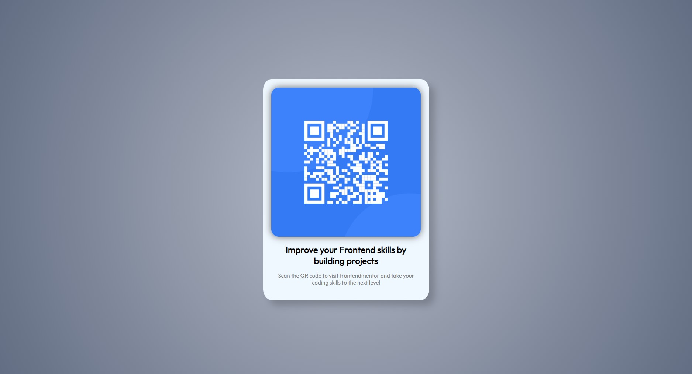

# Frontend Mentor - QR code component my solution

This is a solution to the [QR code component challenge on Frontend Mentor](https://www.frontendmentor.io/challenges/qr-code-component-iux_sIO_H). Frontend Mentor challenges help you improve your coding skills by building realistic projects.

## Table of contents

- [Overview](#overview)
  - [Screenshot](#screenshot)
  - [Links](#links)
- [My process](#my-process)
  - [Built with](#built-with)
  - [What I learned](#what-i-learned)
  - [Continued development](#continued-development)
- [Author](#author)


## Overview

### Screenshot



### Links

- Live Site URL:(https://mrintoxx.github.io/QR-code-component/)

## My process

### Built with

- Semantic HTML5 markup
- CSS custom properties
- Flexbox

### What I learned

This is a great way top understand css behavior, and also to improve some html basic skills.

This was the frist time i'm using a gradiant background in CSS

```css
body {
  background: radial-gradient(
    circle at center,
    hsl(220, 15%, 75%),
    hsl(220, 15%, 45%)
  );
}
```

### Continued development

In the future i could improve the code to make a smoother responsive desgin.

## Author

- Frontend Mentor - [Mrintoxx](https://www.frontendmentor.io/profile/mrintoxx)
